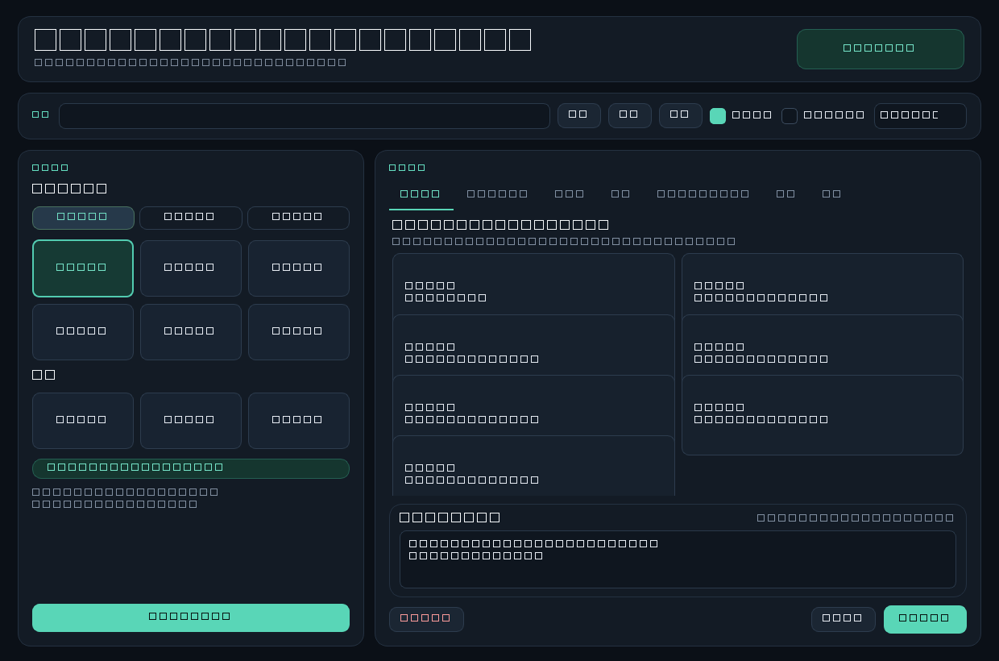

# MINI KeyBoard Studio

A local-only desktop app (Python + PySide6) that configures a **MINI KeyBoard**
macro pad, built by reverse-engineering the vendor C# tool's HID protocol — the
original `MINI KeyBoard.exe` is never launched.

- 6 programmable keys, a rotary encoder (turn left / press / turn right), 3 layers
- **Two HID protocol variants** recovered from the vendor tool and reimplemented
  from scratch (legacy PID `0x8890` on interface 1; newer `0x8830` / `0x8840` on interface 0)
- **Simulation mode is the default** — nothing is written over USB until you opt in
- Every HID write shows a 64-byte packet preview and asks for confirmation
- Text macros typed via Windows Unicode input: no clipboard, no network, no telemetry,
  no kernel driver



## Protocol

The vendor tool speaks 64-byte HID output reports. `mini_keyboard/protocol.py`
rebuilds both encodings it uses:

| | Protocol 1 (legacy) | Protocol 2 |
|---|---|---|
| Example PID | `0x8890` | `0x8830`, `0x8840` |
| HID interface | 1 | 0 |
| Payload | fixed header + key/modifier pairs | grouped, variable group count |

`tests/test_protocol.py` pins the encoder against known-good byte sequences, so a
refactor cannot silently change what gets written to the hardware.

## Install & run

```powershell
python -m venv .venv
.\.venv\Scripts\python.exe -m pip install -r requirements.txt
.\.venv\Scripts\python.exe run.py
```

Or double-click `啟動設定工具.bat`.

Requires Windows for the volume/auto-start integration (`windows_runtime.py`);
the protocol layer itself is platform independent.

Traditional Chinese: [README.zh-TW.md](README.zh-TW.md)


## License

MIT. See [LICENSE](LICENSE).

The HID protocol was **reimplemented** from observed behaviour of the vendor
tool; no vendor code or firmware is included. `MINI KeyBoard` and related marks
belong to their respective owners. This project is not affiliated with or
endorsed by them.

## Disclaimer

Hardware mode writes to the keyboard's configuration memory. Every write shows
a packet preview and asks for confirmation first, but you use it at your own
risk — the author is not liable for damaged hardware.
